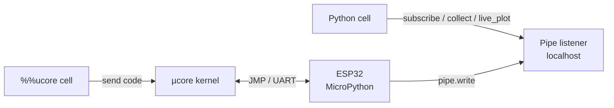
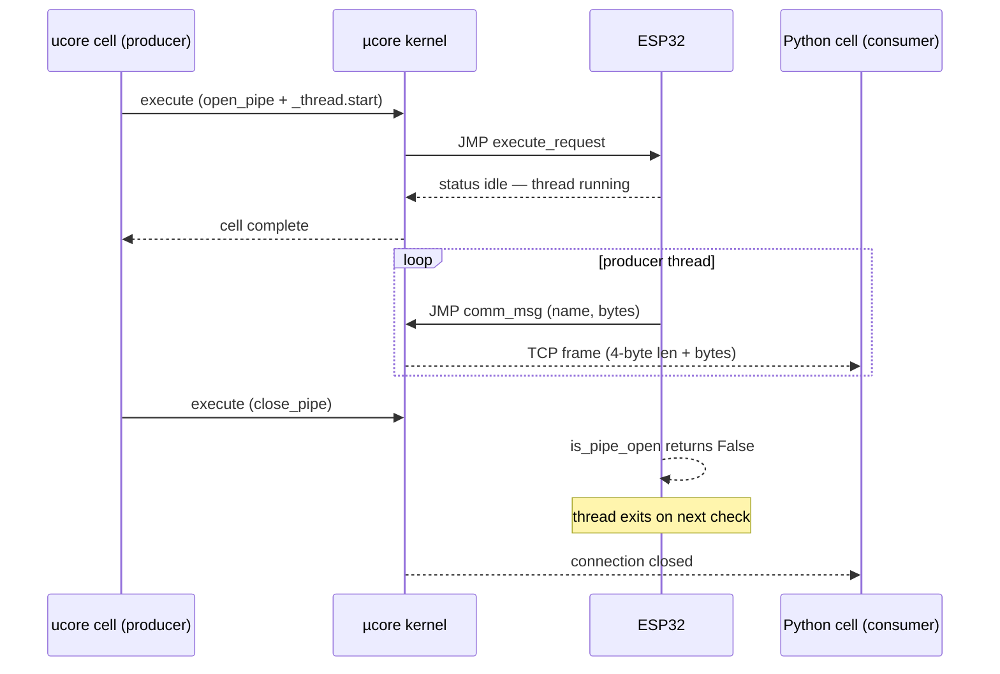

# Pipes

Pipes are named byte channels from the microcontroller to the host. A producer
thread on the ESP32 writes frames; consumer code in a regular notebook cell
reads them. Because the producer runs in a background thread, the producing
cell returns immediately — data keeps flowing while you work in other cells.

## How it works

µcore routes cells to two different execution environments:



`%%ucore` cells are sent to the microcontroller over the JMP serial transport
and execute in MicroPython. Regular cells execute in a local Python
sub-kernel on the host. Pipes bridge the two: the microcontroller sends frames
over JMP; the kernel's pipe listener rebroadcasts them over a localhost TCP
socket that host-side consumers subscribe to.

## Pipe lifecycle



## Microcontroller-side API

Import `ucore` in any `%%ucore` cell — it is frozen into the firmware.

---

### `ucore.open_pipe(name)` → `Pipe`

Opens a named pipe and returns a `Pipe` object. If the pipe is already open,
returns a new handle without re-opening it.

```python
%%ucore
pipe = ucore.open_pipe("adc")
```

---

### `ucore.close_pipe(name)`

Closes the pipe. Idempotent — safe to call even if already closed. Any
background thread polling `is_pipe_open(name)` will see `False` on its next
check and should exit.

```python
%%ucore
ucore.close_pipe("adc")
```

---

### `ucore.is_pipe_open(name)` → `bool`

Returns `True` while the pipe is open. Use this as the stop condition in
producer loops so they exit cleanly when the pipe is closed from any cell.

```python
%%ucore
while ucore.is_pipe_open("adc"):
    pipe.write(...)
    time.sleep_ms(20)
```

---

### `Pipe.write(data)`

Sends one frame to the host. Each call is one atomic chunk — the host
receives it as a single `bytes` object. Maximum 65 535 bytes per call.

```python
%%ucore
import struct
pipe.write(struct.pack("<f", sensor.read()))
```

---

### `Pipe.close()`

Equivalent to `ucore.close_pipe(self.name)`. Also available as a context
manager for finite producers:

```python
%%ucore
with ucore.open_pipe("adc") as pipe:
    for _ in range(100):
        pipe.write(struct.pack("<f", adc.read_uv() / 1e6))
        time.sleep_ms(10)
# pipe closed automatically on exit
```

---

## Host-side API

```python
from ukernel.pipes import subscribe, collect, live_plot, stop_live
```

---

### `subscribe(name)` → `Pipe`

Low-level subscribe. Returns a `Pipe` that yields one `bytes` chunk per
microcontroller-side `pipe.write()` call. Blocks until the next chunk
arrives; iteration ends when the kernel closes the connection.

Always use as a context manager so the socket is closed on exit:

```python
import struct
from ukernel.pipes import subscribe

with subscribe("adc") as pipe:
    for chunk in pipe:
        value, = struct.unpack("<f", chunk)
        print(f"{value:.4f} V")
```

To read a fixed number of samples:

```python
with subscribe("adc") as pipe:
    for i, chunk in enumerate(pipe):
        if i >= 50:
            break
        # process chunk
```

---

### `collect(name, *, n, seconds, decoder, allow_empty)` → `ndarray`

Blocks until `n` samples have arrived **or** `seconds` of wall time have
elapsed, whichever comes first. Returns a NumPy array (or plain list if NumPy
is not installed).

At least one of `n` or `seconds` is required; both can be given together.

| Parameter | Type | Default | Description |
|---|---|---|---|
| `name` | `str` | — | Pipe name |
| `n` | `int \| None` | `None` | Stop after this many samples |
| `seconds` | `float \| None` | `None` | Stop after this many seconds |
| `decoder` | `callable \| None` | `struct.unpack("<f", b)[0]` | `bytes → float` |
| `allow_empty` | `bool` | `False` | Return an empty array instead of raising `TimeoutError` when zero samples arrive |

```python
import matplotlib.pyplot as plt
from ukernel.pipes import collect

# capture 200 samples then plot
samples = collect("adc", n=200)
plt.plot(samples)
plt.show()

# capture up to 5 seconds of data
samples = collect("adc", seconds=5)
print(f"{len(samples)} samples, mean = {samples.mean():.3f}")
```

!!! warning "No producer running?"
    `collect` raises `TimeoutError` if zero samples arrive before the
    deadline — usually a sign that no producer is open on the microcontroller.
    Pass `allow_empty=True` to suppress this and receive an empty array.

---

### `live_plot(name, *, decoder, window, ylim, title, interval, duration)`

Subscribes to the pipe and animates the incoming values in a sliding window.
Returns immediately; the chart updates in the background. Requires
`%matplotlib widget` (ipympl).

Re-running the cell (or calling `live_plot` again with the same name) cleanly
tears down the previous chart and starts a fresh one — no manual cleanup
needed.

| Parameter | Type | Default | Description |
|---|---|---|---|
| `name` | `str` | — | Pipe name |
| `decoder` | `callable \| None` | `struct.unpack("<f", b)[0]` | `bytes → float` |
| `window` | `int` | `200` | Samples retained in the sliding window |
| `ylim` | `tuple \| None` | `(-1.5, 1.5)` | Y-axis limits; `None` to autoscale |
| `title` | `str \| None` | `None` | Axes title |
| `interval` | `int` | `40` | Redraw interval in milliseconds (~25 fps) |
| `duration` | `float \| None` | `None` | Auto-stop after this many seconds |

```python
%matplotlib widget
from ukernel.pipes import live_plot

live_plot("adc", window=300, ylim=(0.0, 3.3), title="ADC channel 4 (V)")
```

The animation stops when:

1. The producer closes the pipe — microcontroller-side EOF, host reader stops.
2. `stop_live(name)` is called from any cell.
3. `duration` seconds elapse (if set).

---

### `stop_live(name=None)`

Stops a single live plot by name, or all active live plots when called with no
argument.

```python
from ukernel.pipes import stop_live

stop_live("adc")  # stop one
stop_live()       # stop all
```

---

## Data encoding

Pipes carry raw bytes — there is no built-in serialisation. The convention is
a single little-endian 32-bit float per frame, which is what all the
high-level helpers (`collect`, `live_plot`) expect by default:

```python
# microcontroller
pipe.write(struct.pack("<f", value))

# host — default decoder
value, = struct.unpack("<f", chunk)
```

For multi-channel data, pack multiple values in one write:

```python
%%ucore
# x, y, z from an accelerometer
pipe.write(struct.pack("<fff", ax, ay, az))
```

```python
# host
import struct
from ukernel.pipes import subscribe

with subscribe("imu") as pipe:
    for chunk in pipe:
        ax, ay, az = struct.unpack("<fff", chunk)
```

Pass a custom `decoder` to `collect` or `live_plot` when you need something
other than a single float:

```python
# plot only the x-axis from a 3-float frame
live_plot("imu", decoder=lambda b: struct.unpack("<fff", b)[0])
```

---

## Environment variables

| Variable | Default | Description |
|---|---|---|
| `UCORE_PIPE_PORT` | *(auto)* | Override the pipe listener port. Useful for remote kernels. |
| `UCORE_STATE_PATH` | *(runtime dir)* | Path to the provisioner state file where the port is advertised. |
